> Framer Pricing Plans 2024 Complete Guide: Analysis of the Best Options from Individuals to Businesses 🚀

_Last updated: October 29, 2024_

## Introduction: Revolutionizing Web Design Since Facebook 🌟

In 2011, while working at Facebook, Dutch designers Koen Bok and Jorn van Dijk identified a critical inefficiency: the collaboration between designers and developers was creating significant delays in product development cycles. This insight led to the creation of Framer, a platform that would transform the web design and development process.

Today, Framer has evolved into the world's leading web design platform, serving over 1 million active users, including design teams from tech giants such as:

- 🎵 Spotify
- 🍎 Apple
- 📱 Facebook
- 🚗 Tesla

## Framer’s core strengths: Why choose it? 💪

### 1. Revolutionary design-as-development workflow

- **Seamless design to code conversion**: What you see is what you get, and you can publish it directly after the design is completed
- **Component-level development experience**: Build a fully functional website like building blocks
- **Zero-Code Automation**: No programming required for complex interactions

### 2. Development tools for designers

- **Visual Programming**: Implement programming logic through interface configuration
- **Smart Layout System**: Adaptive Responsive Design
- **Built-in Development Best Practices**: Automatically optimize performance and accessibility

### 3. Integrated collaboration platform

- **Seamless integration of design and development**: Say goodbye to design annotation and development restoration
- **Real-time preview and debugging**: All modifications take effect immediately
- **Version Control and Rollback**: Unified management of design and code

## Pricing Plan Decision Guide 💰

### Decision tree

```mermaid
graph TD
 A[Start selection] --> B{Team size?}
 B -->|Personal| C{Budget?}
 B -->|Team| D{Requirement complexity?}
 C -->|Low| E[Free version]
 C -->|中| F[Professional version]
 D -->|Medium| G[Team Edition]
 D -->|High| H[Enterprise Edition]
```

### Plan comparison table

| Features/Versions      | Free Edition | Mini Edition | Basic Edition | Professional Edition | Enterprise Edition    |
| ---------------------- | ------------ | ------------ | ------------- | -------------------- | --------------------- |
| Price                  | $0/month     | $10/month    | $20/month     | $40/month            | Consultation required |
| Number of pages        | Unlimited    | 2 pages      | 150 pages     | 300 pages            | Unlimited             |
| Monthly Visits         | 1,000        | 1,000        | 10,000        | 200,000              | Custom                |
| Bandwidth Limit        | 100MB        | 1GB          | 10GB          | 100GB                | Custom                |
| CMS Collection         | 10           | None         | 2             | 10                   | Unlimited             |
| CMS Entries            | 1,000        | 1,000        | 1,000         | 10,000               | Custom                |
| Form submissions/month | 50           | 50           | 500           | 2,500                | Custom                |
| Maximum upload size    | 5MB          | 5MB          | 5MB           | 20MB                 | Custom                |
| CDN Acceleration       | Basics       | Basics       | Basics        | Global CDN           | Enterprise Level      |
| Custom Domain Name     | ❌           | ✅           | ✅            | ✅                   | ✅                    |
| Password protected     | ❌           | ❌           | ✅            | ✅                   | ✅                    |
| Analysis Functions     | ❌           | ❌           | ❌            | ✅                   | ✅                    |
| Temporary environment  | ❌           | ❌           | ❌            | ✅                   | ✅                    |
| Online support         | ❌           | ❌           | ❌            | ❌                   | ✅                    |
| Runtime Guarantee      | ❌           | ❌           | ❌            | ❌                   | 99.99%                |

### Plan Comparison Analysis 🤔

#### Mini Plan Limitations

- **Severe Page Restriction**: A 2-page limit for $5/month makes it impractical for even basic portfolio websites
- **Limited Feature Set**: Offers minimal advantages over the free plan except for custom domain support
- **Poor Value Proposition**: Users are better served by either the free plan or upgrading to the Basic plan

#### The value trap of the basic version

- **CMS collection only has 2**: $15/month only provides 2 CMSs, which is extremely unfriendly to content-based websites.
- **Strict access limit**: 10,000 visits is too tight for a growth-stage project
- **The price/performance ratio is not as good as the professional version**: You can get all the features of the professional version by spending $15 more. Why choose the basic version?

#### Marketing strategy for professional version

- **Deliberately designed price ladder**: lack of functions in the basic version + cost-effectiveness of the professional version = guide users to choose the professional version
- **Typical "Inducement Pricing"**: Use contrast to make the Pro version look like the best deal

#### The mystery of the enterprise version

- **"Consultation required" pricing strategy**: the classic "If you ask about the price, it means you can't afford it"
- **Big room for negotiation**: The price is completely customized according to the size of the enterprise, and there may be a huge gap.

### Select Suggestions 💡

1. **Personal User**:

- Test the waters first with the free version
- If you need to customize a domain name, go directly to the professional version. Do not consider the Mini version.
- Avoid the value trap of the basic version

2. **Team User**:

- Choose the professional version directly
- If you have more than 10 people, consider the enterprise version

## Money Saving Strategy: Free Edition + ShipSuperfast Plan 💰

If you think the $40/month price of Framer Professional is too expensive, here is a more economical solution:

### Detailed explanation of the plan

1. **Framer Free** ($0/month)

- Unlimited page designs
- Complete design features
- 10 CMS collections
- Basic hosting services

2. **[ShipSuperfast](https://www.shipsuperfast.com) Hosting** ($9/month)

- Custom domain name
- No bandwidth limitations
- Global CDN acceleration
- SSL certificate support

### Comparison of advantages

| Features           | Framer Pro       | Free + ShipSuperfast |
| ------------------ | ---------------- | -------------------- |
| Monthly fee        | $40              | $9                   |
| Bandwidth Limit    | 100GB            | Unlimited            |
| Access Limits      | 200,000 Visitors | 1,000,000 PV         |
| Custom Domain Name | ✅               | ✅                   |
| CDN Acceleration   | Global CDN       | Global CDN           |
| Number of pages    | 300 pages        | Unlimited            |
| SSL Certificate    | ✅               | ✅                   |

### Usage steps

1. **Set up the Framer project**

- Use the free version to complete your design
- Publish to Framer hosting, no export or other setup required

2. **Configuration [ShipSuperfast](https://www.shipsuperfast.com)**

- Log in to [ShipSuperfast](https://www.shipsuperfast.com)
- Fill in the Framer project link and your custom domain name to add the site
- Set the CNAME record of the custom domain name to saas.shipsuperfast.com
- Wait for the resolution to take effect before your site can be accessed

### Notes

- ⚠️ Lose some advanced features (such as password protection, analysis functions, maximum upload file limit, etc.)
- ✅ But the money saved more than makes up for the inconvenience

### Applicable people

- Independent developer/designer on a limited budget
- High-traffic sites that require high bandwidth to go online

## Summary: Best Framer deployment solutions in 2024 🎯

### Why [ShipSuperfast](https://www.shipsuperfast.com) is the best choice?

1. **Best value for money** 💰

- Framer Pro: $40/month
- [ShipSuperfast](https://www.shipsuperfast.com) Plan: $9/month
- Annual savings: $372

2. **Less Restrictions** 🚀

- No bandwidth limit vs. Framer 100GB limit
- No limit on the number of pages
- No access limit

3. **Core functions complete** ✨

- Custom domain name support
- Global CDN acceleration
- SSL certificate
- real-time updates

### Final Advice 🌟

1. **Personal Portfolio/Small Project**

- ✅ Directly choose Framer free version + [ShipSuperfast](https://www.shipsuperfast.com) ($9/month)
- ❌ Avoid choosing Mini and Basic versions

2. **Medium-sized projects/Team collaboration**

- If you have enough budget: choose the professional version
- Limited budget: ShipSuperfast plan is still enough

3. **Enterprise Level Project**

- Requires complete analysis capabilities and technical support
- It is recommended to contact Framer Enterprise Sales directly

Remember: **Don’t be misled by marketing tactics**. For most individual users and small teams, the combination of Framer free version + [ShipSuperfast](https://www.shipsuperfast.com) is enough to handle 90% of usage scenarios, while also saving a lot of costs. Choose the right plan and invest the money you save in more valuable areas!

> 💡 Tips: If you are creating a portfolio or personal website, it is strongly recommended to try the [ShipSuperfast](https://www.shipsuperfast.com) solution first. If you are really not satisfied, it is not too late to upgrade to the Pro version.
