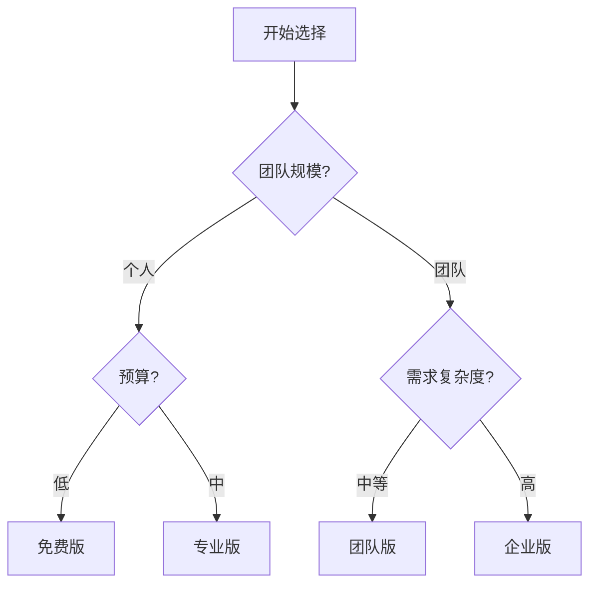

# Framer 定价方案 2024 完全指南：从个人到企业的最佳选择分析 🚀

_最后更新：2024 年 10 月 29 日_

## 引言：从 Facebook 到改变网页设计的故事 🌟

在 2011 年，两位来自荷兰的设计师 Koen Bok 和 Jorn van Dijk 在 Facebook 工作时发现了一个显著的痛点：设计师和开发者之间的协作效率低下，导致产品开发周期被大大拉长。这个发现促使他们创立了 Framer，一个旨在重新定义网页设计和开发流程的平台。

如今，Framer 已发展成为全球领先的网页设计平台，拥有超过 100 万活跃用户，其中包括：

- 🎵 Spotify
- 🍎 Apple
- 📱 Facebook
- 🚗 Tesla
  等科技巨头的设计团队。

## Framer 的核心优势：为什么选择它？ 💪

### 1. 设计即开发的革命性工作流

- **无缝设计到代码转换**：所见即所得,设计完成即可直接发布
- **组件级开发体验**：像搭积木一样构建功能完整的网站
- **零代码自动化**：复杂交互无需编程

### 2. 面向设计师的开发工具

- **可视化编程**：通过界面配置实现编程逻辑
- **智能布局系统**：自适应响应式设计
- **内置开发最佳实践**：自动优化性能和可访问性

### 3. 一体化协作平台

- **设计开发无缝对接**：告别设计标注和开发还原
- **实时预览与调试**：所有修改即时生效
- **版本控制与回滚**：设计和代码统一管理

## 定价方案决策指南 💰

### 决策树

### 方案对比表

| 功能/版本    | 免费版 | Mini 版 | 基础版 | 专业版   | 企业版 |
| ------------ | ------ | ------- | ------ | -------- | ------ |
| 价格         | $0/月  | $10/月  | $20/月 | $40/月   | 需咨询 |
| 页面数量     | 无限制 | 2 页    | 150 页 | 300 页   | 无限制 |
| 月访问量     | 1,000  | 1,000   | 10,000 | 200,000  | 自定义 |
| 带宽限制     | 100MB  | 1GB     | 10GB   | 100GB    | 自定义 |
| CMS 集合     | 10 个  | 无      | 2 个   | 10 个    | 无限制 |
| CMS 条目     | 1,000  | 1,000   | 1,000  | 10,000   | 自定义 |
| 表单提交/月  | 50     | 50      | 500    | 2,500    | 自定义 |
| 最大上传大小 | 5MB    | 5MB     | 5MB    | 20MB     | 自定义 |
| CDN 加速     | 基础   | 基础    | 基础   | 全球 CDN | 企业级 |
| 自定义域名   | ❌     | ✅      | ✅     | ✅       | ✅     |
| 密码保护     | ❌     | ❌      | ✅     | ✅       | ✅     |
| 分析功能     | ❌     | ❌      | ❌     | ✅       | ✅     |
| 暂存环境     | ❌     | ❌      | ❌     | ✅       | ✅     |
| 上线支持     | ❌     | ❌      | ❌     | ❌       | ✅     |
| 运行时保证   | ❌     | ❌      | ❌     | ❌       | 99.99% |

### 定价策略吐槽 🤔

#### Mini 版的尴尬处境

- **2 页限制太苛刻**：$5/月就只能做 2 页？连个基础作品集都放不下
- **功能限制与免费版相近**：除了自定义域名,几乎没有明显优势
- **性价比极低**：建议直接跳过,选择免费版或基础版

#### 基础版的价值陷阱

- **CMS 集合仅 2 个**：$15/月却只给 2 个 CMS ��� 合,对内容型网站极不友好
- **访问量限制严格**：10,000 访问量对成长期项目来说太紧张
- **性价比不如专业版**：多花$15 就能获得专业版全部功能,为什么要选基础版？

#### 专业版的营销策略

- **刻意设计的价格阶梯**：基础版功能缺失 + 专业版性价比 = 引导用户选择专业版
- **典型的"诱导性定价"**：通过对比衬托使专业版看起来最划算

#### 企业版的神秘面纱

- **"需咨询"的价格策略**：经典的"如果要问价格就说明你付不起"
- **谈判空间大**：价格完全根据企业体量定制,可能差距巨大

### 选择建议 💡

1. **个人用户**：

   - 先用免费版试水
   - 需要自定义域名直接上专业版,不要考虑 Mini 版
   - 避开基础版的价值陷阱

2. **团队用户**：
   - 直接选择专业版
   - 超过 10 人再考虑企业版

## 省钱攻略：免费版 + ShipSuperfast 方案 💰

如果你觉得 Framer 专业版 $40/月的价格太贵,这里有个更经济的解决方案:

### 方案详解

1. **Framer 免费版** ($0/月)

   - 无限页面设计
   - 完整的设计功能
   - 10 个 CMS 集合
   - 基础托管服务

2. **[ShipSuperfast](https://www.shipsuperfast.com) 托管** ($9/月)
   - 自定义域名
   - 无带宽限制
   - 全球 CDN 加速
   - SSL 证书支持

### 优势对比

| 功能特性   | Framer 专业版 | 免费版+ShipSuperfast |
| ---------- | ------------- | -------------------- |
| 月费用     | $40           | $9                   |
| 带宽限制   | 100GB         | 无限制               |
| 访问限制   | 200,000 访客  | 1,000,000 PV         |
| 自定义域名 | ✅            | ✅                   |
| CDN 加速   | 全球 CDN      | 全球 CDN             |
| 页面数量   | 300 页        | 无限制               |
| SSL 证书   | ✅            | ✅                   |

### 使用步骤

1. **设置 Framer 项目**

   - 使用免费版完成设计
   - 发布到 Framer 托管，无需导出或其它设置

2. **配置 [ShipSuperfast](https://www.shipsuperfast.com)**
   - 登录 [ShipSuperfast](https://www.shipsuperfast.com)
   - 填入 Framer 项目链接以及您的自定义域名添加站点
   - 设置自定义域名的 CNAME 记录为 saas.shipsuperfast.com
   - 等待解析生效后您的站点即可访问

### 注意事项

- ⚠️ 失去部分高级功能(如密码保护、分析功能、最大上传文件限制等)
- ✅ 但省下的钱足以弥补这些不便

### 适用人群

- 预算有限的独立开发者/设计师
- 需要带宽上线较高的高流量站 ���

## 总结：2024 年最佳 Framer 部署方案 🎯

### 为什么 [ShipSuperfast](https://www.shipsuperfast.com) 是最佳选择？

1. **性价比最高** 💰

   - Framer 专业版: $40/月
   - [ShipSuperfast](https://www.shipsuperfast.com) 方案: $9/月
   - 年度节省: $372

2. **更少限制** 🚀

   - 无带宽限制 vs. Framer 100GB 限制
   - 无页面数量限制
   - 无访问量限制

3. **核心功能完整** ✨
   - 自定义域名支持
   - 全球 CDN 加速
   - SSL 证书
   - 实时更新

### 最终建议 🌟

1. **个人作品集/小型项目**

   - ✅ 直接选择 Framer 免费版 + [ShipSuperfast](https://www.shipsuperfast.com) ($9/月)
   - ❌ 避免选择 Mini 版和基础版

2. **中型项目/团队协作**

   - 如果预算充足：选择专业版
   - 预算有限：ShipSuperfast 方案依然够用

3. **企业级项目**
   - 需要完整分析功能和技术支持
   - 建议直接联系 Framer 企业版销售

记住：**不要被营销策略误导**。对于大多数个人用户和小团队来说，Framer 免费版 + [ShipSuperfast](https://www.shipsuperfast.com) 的组合已经足够应对 90%的使用场景，同时还能节省大量成本。选择合适的方案，把省下的钱投入到更有价值的地方！

> 💡 小贴士：如果你正在制 �� 作品集或个人网站，强烈建议先尝试 [ShipSuperfast](https://www.shipsuperfast.com) 方案，实在不满意再升级到专业版也不迟。
